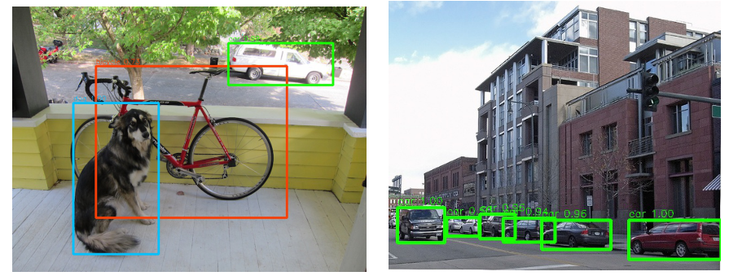

# SSD



## 1. Arguments

All the arguments you may change are in  `ssd/config.py`

（If you did not have GPU，please set `cuda=Fasle` and `test_cuda=False` ）

Training setting：

- `bone = ['vgg', 'res101'][False]`：choose the base network，`True` means `res101`
- `basenet`：the pretrained base network（you may change the `xxx.pth` name）
- `save_folder`：the default save folder for training model

Testing & Evaluation & Demo setting：

- `output_folder`：default folder for "results" 
- `trained_model`：the pretrained "whole" model --- download from provide or training by yourself（you may change the `xxx.pth` name）

## 2. Demo

Download the pretrained model：[vgg_final](https://drive.google.com/open?id=1D9pPJWEwK48DWf1mz18Wl4EZHrQCHw8n)，[resnet_final](https://drive.google.com/open?id=10xIt9vbyibwjmifR-PHBJTQNYltrrNQA) to `weights/ssd`

```shell
cd ssd
python demo.py
```

Note：

1. you can use your own images by change `img_list` （in `demo.py` file）to your own image path
2. the "boxed" image is saved in `results/ssd/demo`

## 3. Training

Download the pretrained base model：Google Drive --- [vgg_rfc](https://drive.google.com/open?id=1QWjU2r1q9pWdiK9Ju-BpLM1FHGv_X-Dm)，[res_rfc](https://drive.google.com/open?id=15jWvpqNR2KK4Tlo3bADrY2sydnzpnVoF) . Baidu Drive --- [vgg_rfc](https://pan.baidu.com/s/1PggWixjNfPBb-wzrPFadIA)，[res_rfc](https://pan.baidu.com/s/1WXW7J7fR3h7qbPaKGyZEOw)  to `weights/ssd`

Change the training setting to your "favoriate"（in `config.py` file）

```shell
python train.py
```

## 4. Testing

```shell
python test.py
```

Note：the results can be seen in `results/ssd/test`

## 5. Evaluation

```shell
python eval_v2.py
```

Note：the results save in `results/ssd/eval`（if you want to re-run the results (e.g. you use new model)，please delete `results/ssd/eval/all.txt` before re-run `python eval_v2.py`）


Welcome to pull issue if you meet some problems～:smile: