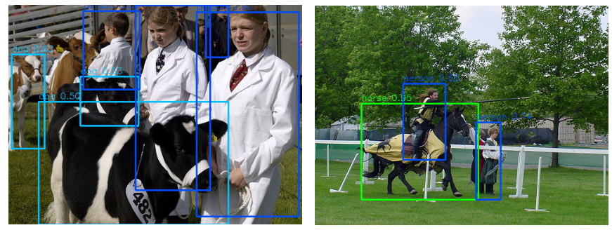

# YOLO v2



## 1. Arguments

All the arguments you may change are in  `yolo/config/yolo_voc.py`

（If you did not have GPU，please set `cuda=Fasle` and `test_cuda=False` ）

Training setting：

- `warm_epoch=3`：set first 3 epoches as warm（maybe one epoch is enough）
- `multi_epoch=5`：every 5 epoches，change the input size（Please test the maximum size before training due to avoid out of memory ~ you can also use one scale by change `multi_scale_img_size=[416]`）
- `basenet`：the pretrained base network（you may change the `xxx.pth` name）
- `save_folder`：the default save folder for training model

Testing & Evaluation & Demo setting：

- `output_folder`：default folder for "results" 
- `trained_model`：the pretrained "whole" model --- download from provide or training by yourself（you may change the `xxx.pth` name）

## 2. Demo

Download the pretrained model：[yolo-voc](https://drive.google.com/open?id=18J1jkENolbV_UW8l2Ds-RhNwFRUFtUZH) to `weights/yolo`

```shell
cd yolo
python demo.py
```

Note：

1. you can use your own images by change `img_list` （in `demo.py` file）to your own image path
2. the "boxed" image is saved in `results/yolo/demo`

## 3. Training

Download the pretrained base model：[darknet](https://drive.google.com/open?id=1Kmt3twmX7k18rtyID_zj4HR17sAL5L9P) to `weights/yolo`

Change the training setting to your "favoriate"（in `config/yolo_voc.py` file）

```shell
python train.py
```

### train_overfit

You may curious about why there is a file named `train_overfit.py`，this file is training the model in one single image（If you want to modify the model，it's a good way to verify whether the change works right --- only <1000 iterations in single image can show you a good results on this image（if you can not get well results on this single image, there must be something wrong on your code））

```shell
python train_overfit.py
```

Will get a `single.pth` in `weights/yolo`，and you can use this weights to run `demo.py` in the training image.（modify `trained_model=../weights/yolo/single.pth` in `yolo_voc.py`）

## 4. Testing

```shell
python test.py
```

Note：the results can be seen in `results/yolo/test`

## 5. Evaluation

```shell
python eval_v2.py
```

Note：the results save in `results/yolo/eval`（if you want to re-run the results (e.g. you use new model)，please delete `results/yolo/eval/all.txt` before re-run `python eval_v2.py`）


Welcome to pull issue if you meet some problems～:smile: