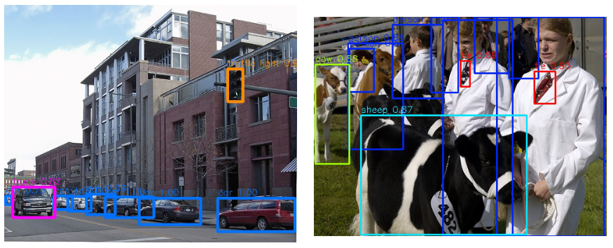

# YOLO v3



## 1. Arguments

All the arguments you may change are in  `yolo3/config/yolo3_coco.py`

Demo setting：

- `output_folder`：default folder for "results" 
- `trained_model`：the pretrained "whole" model --- download from provide or training by yourself（you may change the `xxx.pth` name）

## 2. Demo

Download the pretrained model：[yolo3]() to `weights/yolo3`

```shell
cd yolo3
python demo.py
```

Note：

1. you can use your own images by change `img_list` （in `demo.py` file）to your own image path
2. the "boxed" image is in `results/yolo3/demo`


Welcome to pull issue if you meet some problems～:smile: